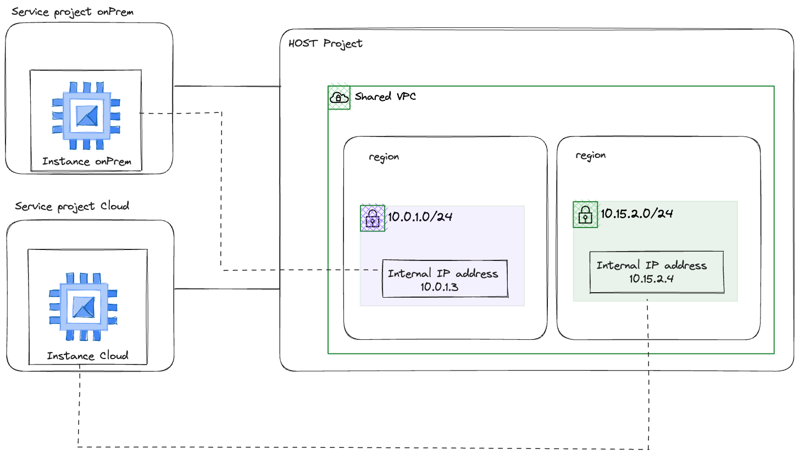

### Architecture



### Create Host Project and Service Projects

#### Create Projects
- Create a project to act as the host project for the Shared VPC.
- Create a project to act as the dev fleet service project
- Create a project to act as the prod fleet service project.

#### Create VPC and Subnets
- Create VPC in Host Project
- Create dev Subnet
- Create prod Subnet

### Roles required for GKE onPrem

Role | Purpose
--- | ---
roles/compute.viewer | Required: Needed when bmctl validates the clusterOperations.location field in the cluster configuration file.
roles/iam.serviceAccountAdmin | Required: Needed to create the service accounts that that Anthos clusters on bare metal requires.
roles/iam.securityAdmin | Required: Needed to grant IAM roles to the service accounts that Anthos clusters on bare metal requires.
roles/iam.serviceAccountKeyAdmin | Required: Needed to create JSON key files for the service accounts that Anthos clusters on bare metal requires.
roles/serviceusage.serviceUsageAdmin | Required: Needed to enable the Google APIs that Anthos clusters on bare metal requires.
roles/gkeonprem.admin | Optional: Needed if you want to create clusters using Anthos On-Prem API clients or configure a cluster to be managed by the Anthos On-Prem API.
roles/gkehub.viewer
roles/container.viewer | Optional: Needed if you want to access the Anthos and Google Kubernetes Engine pages in the Google Cloud console.

### APIs required for GKE onPrem

```
anthos.googleapis.com
anthosaudit.googleapis.com
anthosgke.googleapis.com
cloudresourcemanager.googleapis.com
connectgateway.googleapis.com
container.googleapis.com
gkeconnect.googleapis.com
gkehub.googleapis.com
gkeonprem.googleapis.com
iam.googleapis.com
logging.googleapis.com
monitoring.googleapis.com
opsconfigmonitoring.googleapis.com
serviceusage.googleapis.com
stackdriver.googleapis.com
storage.googleapis.com
```

### Service accounts and role bindings required for GKE onPrem

Service account | Purpose | Roles
--- | --- | ---
anthos-baremetal-gcr | Anthos clusters on bare metal uses this service account to download container images from Container Registry. | None
anthos-baremetal-connect | Connect Agent uses this service account to maintain a connection between your cluster and Google Cloud. This enables access to the cluster and to workload management features, including the Google Cloud console and the Connect gateway to interact with your cluster. | roles/gkehub.connect
anthos-baremetal-register | Connect Agent uses this service account to register your clusters with a fleet. | roles/gkehub.admin
anthos-baremetal-cloud-ops | Stackdriver Agent uses this service account to export logs and metrics from clusters to Cloud Logging and Cloud Monitoring. | roles/logging.logWriter, roles/monitoring.metricWriter, roles/stackdriver.resourceMetadata.writer, roles/opsconfigmonitoring.resourceMetadata.writer, roles/monitoring.dashboardEditor

For further information about GKE onprem requirements, see [here](https://cloud.google.com/anthos/clusters/docs/bare-metal/latest/installing/configure-sa)

### APIs required for fleet-managed GKE

```
container.googleapis.com
gkeconnect.googleapis.com
gkehub.googleapis.com
cloudresourcemanager.googleapis.com
iam.googleapis.com
```

For further information about GKE fleet management requirements, see [here](https://cloud.google.com/anthos/fleet-management/docs/before-you-begin)